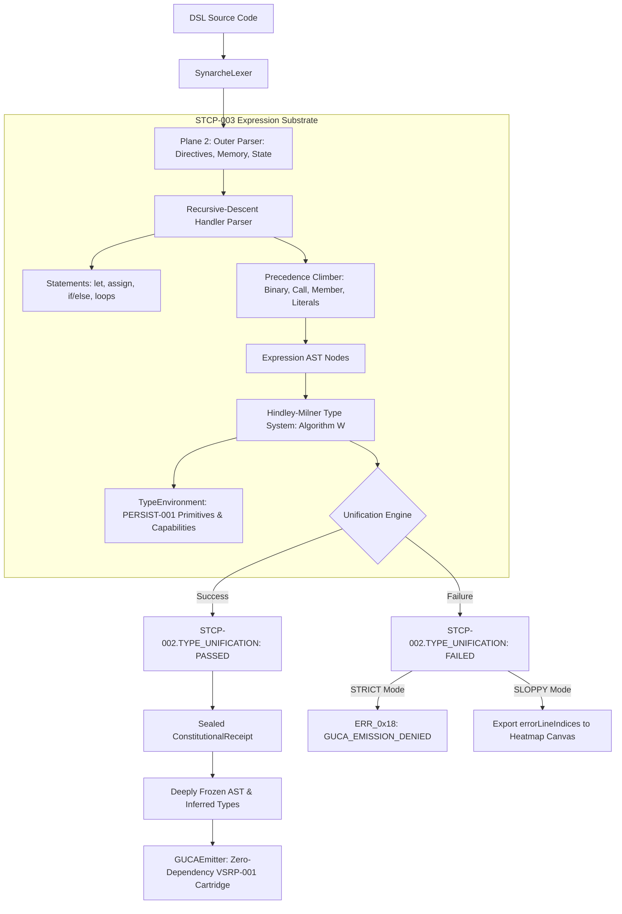

# ARCH-SPEC-STCP-003: Sovereign Recursive-Descent Type Inference Engine

**Standard:** STCP-003 / VSRP-001 / PERSIST-001 / PSGC-001  
**Authority:** Pure Language Architecture Substrate (Zero-Dependency Vanilla JavaScript)  
**Status:** ARCHITECTURAL SPECIFICATION & EXECUTION BLUEPRINT  

---

## 1. Executive Architecture Summary

STCP-003 upgrades the ingestion chassis of the Phoenix Sovereign Engine from a **DSL outer-parser with regex semantic scanning** into a **two-tier recursive-descent compiler with full Hindley-Milner type inference**.



---

## 2. Technical Decisions & Design Consensus

Following the `/grill-me` architectural review, the design invariants are:

| Decision Area | Selected Strategy | Rationale |
| :--- | :--- | :--- |
| **Handler Syntax Scope** | **Hybrid Sub-Language** | Parses variable declarations (`let x = ...`), assignments (`state.x = ...`, `memory.y = ...`), arithmetic/logical expressions, and control flow (`if/else`, loops, calls) in strict mode, while falling back gracefully in sloppy mode. |
| **Type Representation** | **Sovereign Fixed-Width & Simulation Primitives** | Models `u8`, `u16`, `u32`, `i32`, `f32`, `bool`, `string`, `void`, `Array<T>`, and `Function(params, ret)`. Bounds-checked unification prevents PERSIST-001 memory overflows at compile time. |
| **Constitutional Gate** | **8th Invariant (`STCP-002.TYPE_UNIFICATION`)** | Added to `CONSTITUTIONAL_RULE_REGISTRY`. If unification fails, the admission receipt is `REJECTED`, and `GUCAEmitter.emit()` fails closed in STRICT mode. |
| **Semantic Detection** | **100% AST-Driven (Zero Regex)** | Replaces fragile regex checks with AST node types (`NewExpr`, `ObjectLiteral`, `ArrayLiteral` in hot loops) and attaches an attenuated capability schema to `ctx`. |
| **IDE & Telemetry** | **Type Map & Heatmap Offsets** | Compilations return `inferredTypes` (for ghost mirror type overlays) and `errorLineIndices` (for real-time canvas error bars matching `state_space_workspace.html`). |

---

## 3. Core Component Architecture

### 3.1 Type System & Unification (`Hindley-Milner Algorithm W`)

```javascript
class SynarcheTypeSystem {
    createPrimitive(name) { return { kind: 'Primitive', name }; }
    createVariable(id) { return { kind: 'Variable', id, instance: null }; }
    createArray(elementType) { return { kind: 'Array', elementType }; }
    createFunction(params, returnType) { return { kind: 'Function', params, returnType }; }
    createRecord(fields) { return { kind: 'Record', fields: new Map(fields) }; }

    prune(type) {
        if (type.kind === 'Variable' && type.instance) {
            type.instance = this.prune(type.instance);
            return type.instance;
        }
        return type;
    }

    unify(a, b, context = {}) {
        const t1 = this.prune(a);
        const t2 = this.prune(b);
        // Full occurs-check, primitive matching, fixed-width numeric compatibility,
        // and function arity checks as proven in state_space_workspace.html
    }
}
```

### 3.2 Precedence-Climbing Expression Parser

Recognizes binary expressions, member expressions, function invocations, and literals:
* Precedence: `* / %` (prec 3) > `+ -` (prec 2) > `== != < <= > >=` (prec 1) > `&& ||` (prec 0).
* Member access: `state.foo`, `memory.bar`, `ctx.audio.playTone()`.
* AST Node types: `VarDecl`, `AssignExpr`, `BinaryExpr`, `UnaryExpr`, `CallExpr`, `MemberExpr`, `Identifier`, `Literal`, `BlockStmt`, `IfStmt`, `WhileStmt`.

### 3.3 Zero-Allocation & Capability Rules

* In `on update(temporalTick, input)`: If any AST statement or expression constructs a `NewExpr`, `ObjectLiteral`, or `ArrayLiteral`, the AST walker reports `ERR_0x17: TRANSIENT_HOT_LOOP_ALLOCATION` with exact line and column numbers.
* In `on render(ctx)` or `on configure(ctx)`: `ctx` is typed with declared capabilities (`CAP_RENDER_CANVAS2D`, `CAP_AUDIO_SYNTH`). Accessing `ctx.canvas` without `CAP_RENDER_CANVAS2D` fails type unification with `ERR_0x15: CAPABILITY_UNIFICATION_FAILURE`.

---

## 4. Implementation Phasing

1. **Phase 1: Recursive-Descent Expression Parser & AST Factory**
   * Add AST node definitions and expression parser into `phoenix/synarche_parser.js`.
   * Update `_parseBlock()` to parse statement lists into structured AST nodes while retaining raw source slicing for emitter backwards compatibility.
2. **Phase 2: Hindley-Milner Type System & Environment Seeding**
   * Integrate `SynarcheTypeSystem` and `SynarcheTypeEnvironment`.
   * Seed environment with `state` fields, `memory` fields, and capability objects.
   * Run type inference pass over handler ASTs and record `inferredTypes` and `errorLineIndices`.
3. **Phase 3: Constitutional Admission Gate & ERL-001 Integration**
   * Add `STCP-002.TYPE_UNIFICATION` to `CONSTITUTIONAL_RULE_REGISTRY`.
   * Wire `SynarcheAdmissionAuthority.admit()` to assert zero type errors.
   * Expand test suite in `testing/test_synarche_parser.js` to prove type safety and mutation immunity.
